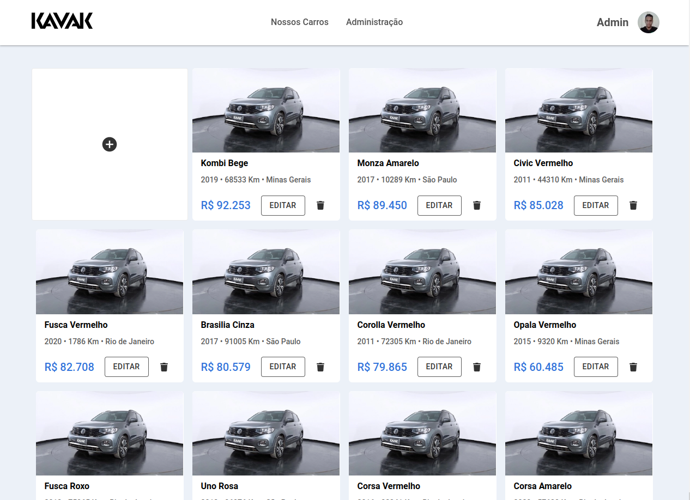
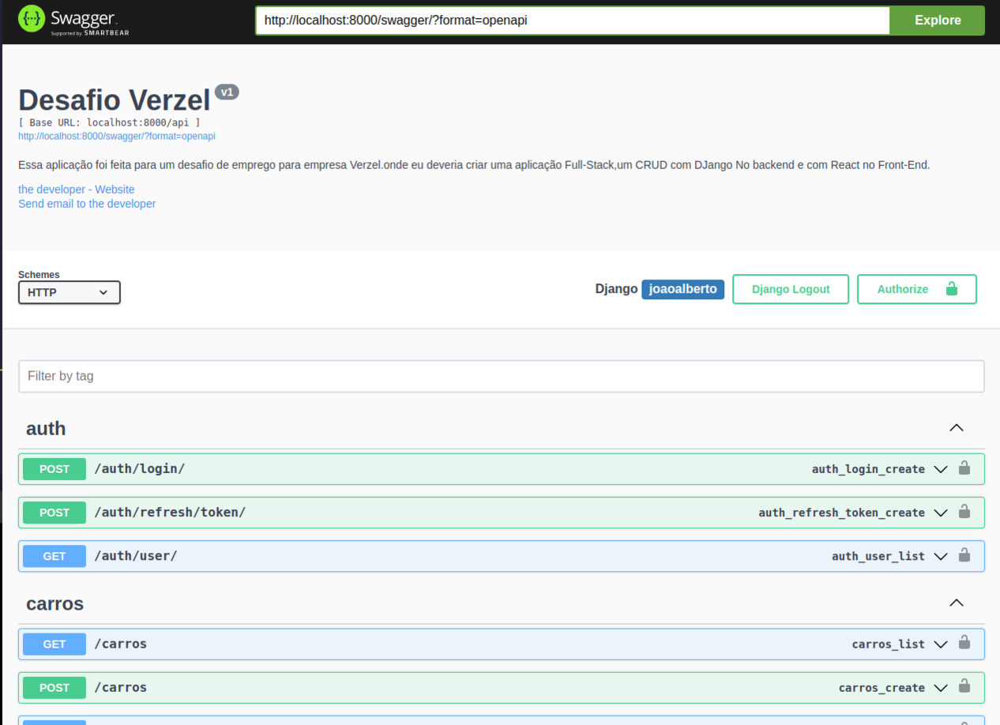

<h1 align="center">
    <a href="#"> Desafio Verzel 🏆</a>
</h1>

<h4 align="center">
	 Status: Terminado
</h4>

<p align="center">
 <a href="#about">Sobre</a> •
 <a href="#instruções">Instruções para rodar a aplicação</a> •
 <a href="#endPoints">End Points</a> •
 <a href="#license">License</a>
</p>

<br />
<div id="about" />

## 💻 Sobre o desafio da aplicação:

Essa aplicação foi feita para um desafio de emprego para empresa [Verzel](https://verzel.com.br/). onde eu deveria criar uma aplicação Full-Stack, um CRUD com DJango No backend e com React no Front-End.

<br />


<table width="100%">
  <tr>
    <td>
      <h2 align="center">
        <a 
          href="" 
          target="_blank"
        >
          Aplicação web
        </a>
      </h2>
      
    </td>
    <td>
      <h2 align="center">
        <a 
          href="" 
          target="_blank"
        >
          Documentação Bckend
        </a>
      </h2>
      
    </td>
  </tr>
</table>


<br />

<details>
  <summary> 🖥️ Tecnologias Utilizadas no Backend</summary>
   <br />

   - PYTHON
   - DJANGO
   - DJANGO_RESTFRAMEWORK_SIMPLE_JWT
   - MYSQL
   - Docker
   - Jsonwebtoken

</details>
<br />
<details>
  <summary> 🖥️ Tecnologias Utilizadas no FrontEnd</summary>
   <br />

   - Next js
   - Typescript
   - SASS
   - Docker
   - Axios
   - Yup
   - React hook form
   - ESLint

</details>

<br />

<div id="instruções" />

## 🚀 Como executar o projeto.

<br />

Este projeto é divido em duas partes:
1. Backend (API)
2. Frontend

💡O Backend deve estar rodando em sua máquina para que o frontend seja renderizado

### Pré-requisitos

<br />

Antes de começar, você vai precisar ter instalado em sua máquina as seguintes ferramentas:
[Git](https://git-scm.com), [Node.js](https://nodejs.org/en/).
Além disto é bom ter um editor para trabalhar com o código como [VSCode](https://code.visualstudio.com/)

<br />

### 🎲 Rodando a aplicação por completo (Backend, Frontend) com Docker

Será necessário que a porta 3000 e 8000 estejam disponíveis para a aplicação, Mysql usará a porta 3306 

1 - Clone o repositório em uma pasta de sua preferencia 
```
  $ git clone git@github.com:JoaoAlberto20/Desafio_Verzel.git
  $ cd Desafio_Verzel
```
2 - E suba o docker-compose, todas as dependências serão automaticamente instaladas
```
  $ killall node
  
  $ npm run compose:up:dev   // para subir a aplicação

```
3 - Após rodar os comando, aguarde um pouco que a aplicação irá ficar disponível nas seguintes rotas:

```
  - Front End: http://localhost:3000

  - Back End: http://localhost:8000

  - Documentação Backend: http://localhost:8000/swagger/

```

4 - E para parar a aplicação por completo  rode o seguinte comando 

```

  $ npm run compose:down:dev

  $ docker image prune -a

```
---

<div id="endPoints" />

## 🎲 Endpoints do Back-End

<br />

### Login de usuário

| Método | Funcionalidade | URL |
|---|---|---|
| `POST` | Realiza o login do usuário | http://localhost:8000/api/auth/login/ |
| `GET` | Verifica se o usuário possui um token valido | http://localhost:8000/auth/user |

Nessa requisição POST é necessário informar o seguinte JSON:

```
{
  "email": "Email do admin",
  "password": "senha_secreta do admin"
}

```

### Listar Carros

| Método | Funcionalidade | URL |
|---|---|---|
| `GET` | Retornar a lista de todos os carros | http://localhost:8000/api/carros |

```
  [
    {
      "name": "Gol MSI 4P",
      "brand": "Volkswagen",
      "model": "Gol MSI 4P AUTOMÁTICO",
      "image_url": "https://images.kavak.services/images/209294/EXTERIOR-frontSidePilotNear-1671133867953.jpeg?d=540x310",
      "year": 2022,
      "location": "Minas Gerais",
      "mileage": 19865,
      "original_value": "76599.00",
    }
  ]

```

### CRUD

| Método | Funcionalidade | URL |
|---|---|---|
| `POST` | Criação de um carro | http://localhost:8000/api/carros |
| `PATCH` | Atualização de um o carro | http://localhost:8000/api/carros/id_do_carro |
| `DELETE` | Deleção de um carro | http://localhost:8000/api/carros/id_do_carro |

Nessa requisição POST é necessário informar o seguinte JSON: 

```
{
	"name": "Gol MSI 4P",
	"brand": "Volkswagen",
	"model": "Gol MSI 4P AUTOMÁTICO",
	"image_url": "https://images.kavak.services/images/209294/EXTERIOR-frontSidePilotNear-1671133867953.jpeg?d=540x310",
	"year": 2022,
	"location": "Minas Gerais",
	"mileage": 19865,
	"original_value": "76599.00",
}

```

E na requisição PATCH pode passar apenas o dado que você que atualizar  e passar o ID do carro que você deseja atualizar no parâmetro da requisição:

```
{
  "name": "Gol MSI 4P",
}

```

E na requisição DELETE pode passar apenas o ID do carro que você que deletar pelos parâmetro da requisição:

```
  http://localhost:8000/api/carros/id_do_carro

```

<div id="license" />

## 📝 License

This project is under the license [MIT](./LICENSE).

Made with ❤️ by João Alberto [Get in Touch!](https://www.linkedin.com/in/joaoalbertosvcode)

---